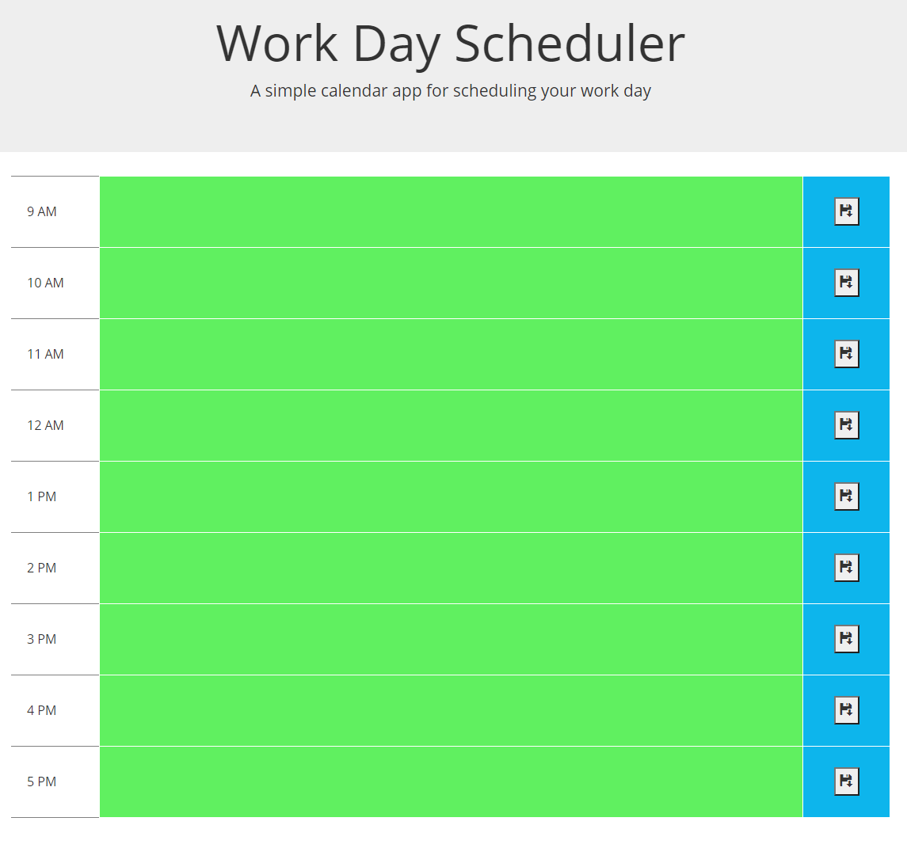
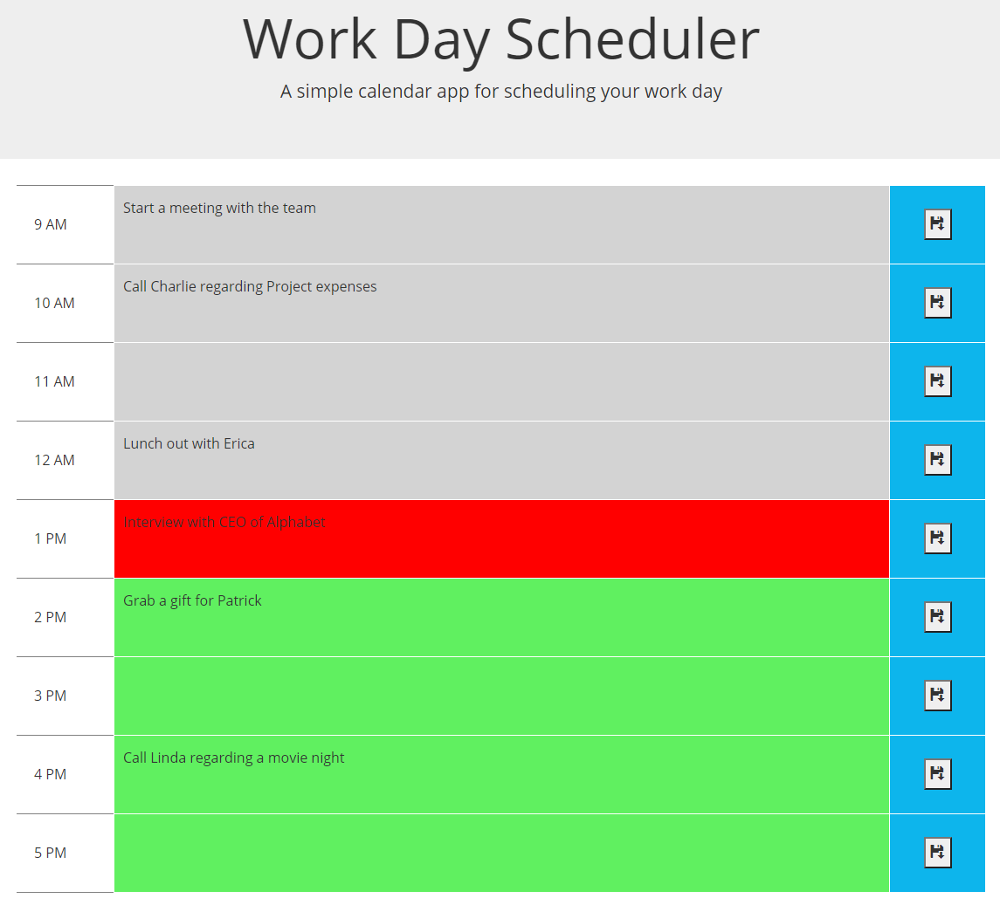

# Work Day Scheduler
 
 

[URL of the website](https://kzhaanbaev.github.io/work-day-scheduler/)

 
 

This application will enable user to plan his/her day and schedule work.
Time is between 9 am to 5 pm, normal work hours.
User can input in any given time and save it. Data will be located in local storage and retrieved next time when application is opened.

  

  

Based on the time of the day each row will have different colors
* Past - Grey color
* Current - Red color
* Future - Green color

  

